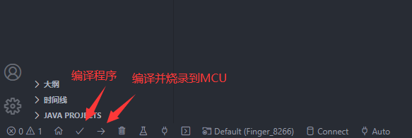

# 宿舍指纹锁方案

> 作者是个 ~~小菜鸡~~ 小白，刚刚接触硬件
> 作者博客[(点击此处)](https://blog.qwwq.top/)

## 1. 物料
### 1.1 物料准备
* esp8266开发板 (淘宝十块钱)
* AS608光学指纹模块 理论上来说 光学指纹和电容指纹通用
* MG90S舵机
* 杜邦线若干
* ~~会干饭的大脑~~

### 1.2 接线方式
#### 1.2.1 指纹模块
* RX -> GPIO3 -> 白线
* D4 -> GPIO2 -> 黄线
* 3v3 -> 红线 绿线
* GND -> 黑线
* D6 -> GPIO12 -> 蓝线
#### 1.2.1 舵机
* 橙线（数据线）-> D2
* 橙黑 -> GND
* 红线 -> 3v3

## 2. 程序

### 2.1 环境安装
> 你需要一个VSCODE和PIO  ~~如果你不知道VSCODE是什么，请放弃本教程~~

去 VSCODE 插件商店搜索 PlatformIO IDE 然后安装 （如果网络不好，请 ~~移居国外，或~~ 更换网络环境）
 安装完成后打开HOME如下图
 
点击 `Import Arduino Project` 导入本项目
 

烧录到8266就OK了

  最后附一张工具图
